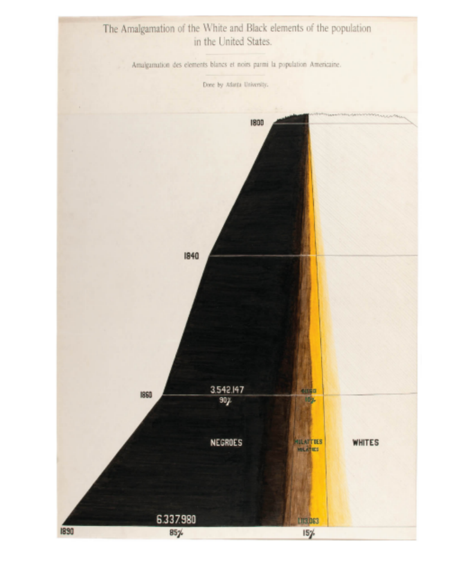
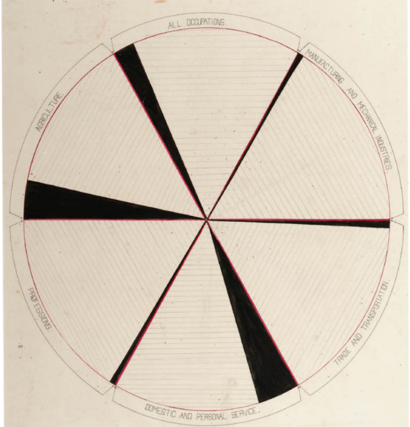

#### Reading

This book is about how Du Bois used data visualization in the American Negro Exhibit to showcase the progress made by African Americans in Georgia since the Civil War.

I learned a lot from this book about different forms of data visualization and how fonts and colors convey emotions and viewpoints. For example, in W. E. B. Du Bois’s exhibits, most charts used black to represent the skin color of African Americans and red to symbolize the bloodshed and sacrifices of their struggles. While black is a common and ordinary color in regular charts and articles, in this series of visualizations, it stands out sharply and solemnly, almost as a declaration of the invisibility that Black people often face in daily life.

My favorite chart shows the changes in the population of people with varying degrees of mixed heritage across different years. What I especially appreciate is the blending of colors, which may have resulted from manual work or time wear. Whether intentional or not, this blending vividly embodies the concept of "the mixing of colors" inherent in the idea of mixed heritage.

The most surprising chart for me is the one that uses a pie chart to compare five related data sets. I never imagined that a pie chart could effectively present multiple layers of information. This inspired me to think about how to convey more information in a single chart without compromising clarity.

I strongly agree with the book's opinion that data visualization can leave a lasting impression on audiences and provide a unique perspective. Most people struggle to grasp abstract numbers but are highly sensitive to visual images. For instance, simply telling people that the diameter of the sun is 109 times that of the Earth may not mean much to them. However, if we display two circles with a 1:109 ratio, they would instantly grasp the scale difference.（Like this.）

I have always believed that designers are people who convey their viewpoints through visual language. Data visualization, as a form of visual rhetoric, can significantly enhance the credibility and authenticity of information. Since people tend to trust what they see, a well-designed visualization can be more engaging and convincing than words or speeches.