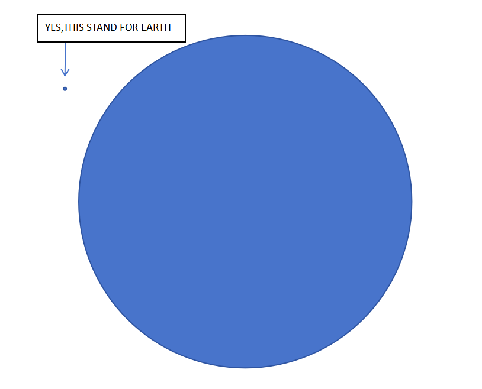
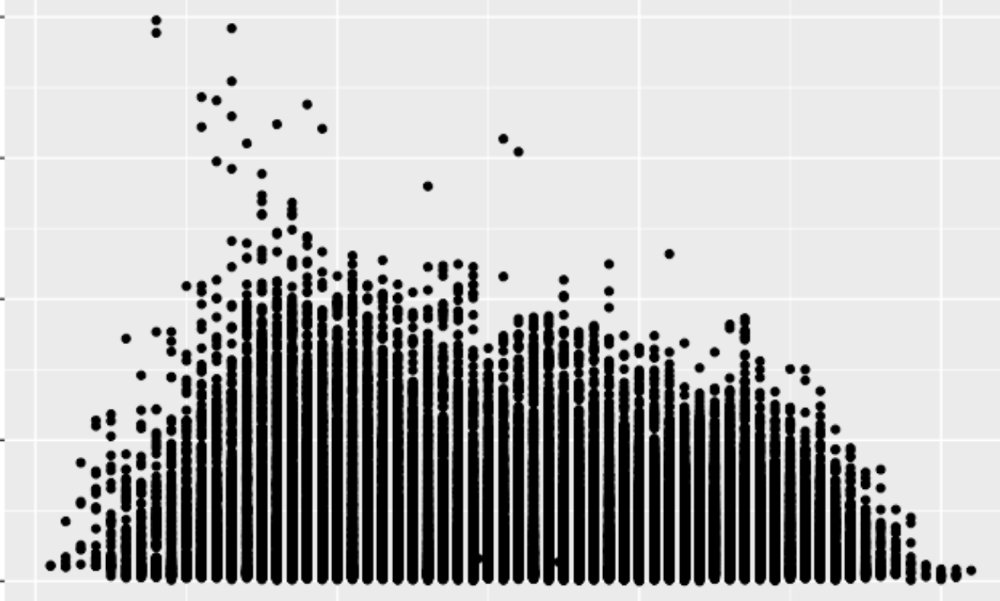
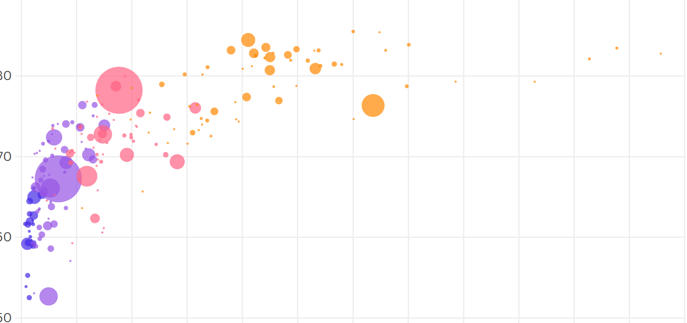

### Reading

This book is about how Du Bois used data visualization in the American Negro Exhibit to showcase the progress made by African Americans in Georgia since the Civil War.

I learned a lot from this book about different forms of data visualization and how fonts and colors convey emotions and viewpoints. For example, in W. E. B. Du Bois's exhibits, most charts used black to represent the skin color of African Americans and red to symbolize the bloodshed and sacrifices of their struggles. While black is a common and ordinary color in regular charts and articles, in this series of visualizations, it stands out sharply and solemnly, almost as a declaration of the invisibility that Black people often face in daily life.

My favorite chart shows the changes in the population of people with varying degrees of mixed heritage across different years. What I especially appreciate is the blending of colors, which may have resulted from manual work or time wear. Whether intentional or not, this blending vividly embodies the concept of "the mixing of colors" inherent in the idea of mixed heritage.

The most surprising chart for me is the one that uses a pie chart to compare five related data sets. I never imagined that a pie chart could effectively present multiple layers of information. This inspired me to think about how to convey more information in a single chart without compromising clarity.

I strongly agree with the book's opinion that data visualization can leave a lasting impression on audiences and provide a unique perspective. Most people struggle to grasp abstract numbers but are highly sensitive to visual images. For instance, simply telling people that the diameter of the sun is 109 times that of the Earth may not mean much to them. However, if we display two circles with a 1:109 ratio, they would instantly grasp the scale difference.（Like this.）

I believed that designers are people who convey their viewpoints through visual language. Data visualization, as a form of visual rhetoric, can significantly enhance the credibility and authenticity of information. Since people tend to trust what they see, a well-designed visualization can be more engaging and convincing than words or speeches.

### Programming

#### What dataset did you use? If not from our class site, include a link.
I used the National Park Species Dataset from Kaggle, available at:https://www.kaggle.com/datasets/umerhaddii/national-park-species-dataset?resource=download

#### Why did you choose this dataset?
I chose this dataset because I am particularly interested in animals. I hope to visualize the types and quantities of animals in national parks to provide a more intuitive understanding of their diversity. Additionally, since I want to include data related to whale populations in my midterm project, I found that the National Park Species Dataset has similar properties to the dataset I need for my project, which also influenced my choice.

#### Which fields/features/parameters of the dataset did you use?
I used the fields CategoryName, SciName, and References from the dataset (I'm not entirely sure what the References column represents; I hope it indicates the number of references). I used 61,120 rows of data, which means I utilized about 183,360 data points considering the three columns.

#### What are you visualizing? How do the shapes, colors or movement relate to the data values?
I visualized the types and quantities of animals from different classes. The size and transparency of the circles indicate the relative quantity of different animal types (even if References does not represent specific quantities, the number of related items can indirectly reflect their relationship in quantity). This visualization also reveals which classes of animals have the most species and quantities.

#### Include drawings and images of reference visualizations

